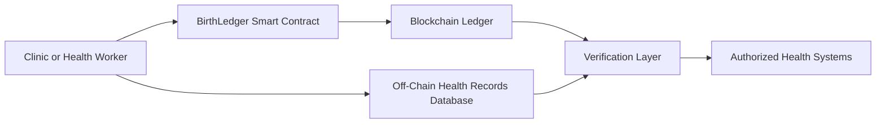

# BirthLedger

BirthLedger is a blockchain-based birth and maternal health event registry designed to improve the integrity, traceability, and accessibility of early-life health records for children.

In many regions, birth records and early maternal health events are fragmented, paper-based, or vulnerable to loss and manipulation. BirthLedger uses blockchain technology to create a tamper-resistant, verifiable record of key health events such as birth registrations, vaccinations, and maternal health visits.

The goal is to provide governments, clinics, and public health systems with a secure digital infrastructure that ensures every child has a trusted record of their earliest health milestones.

This repository contains the MVP smart contract used to record health events on-chain, demonstrating how birth-related data can be securely registered and retrieved using blockchain infrastructure.

## Example Use Case

1. A child is born in a clinic.
2. The clinic records the birth event on BirthLedger.
3. The event is permanently stored on the blockchain.
4. The child's health records can later be verified by authorized systems.

## Technology Stack

- Solidity smart contracts
- Hardhat development framework
- Ethereum-compatible blockchain

## Vision

BirthLedger is designed to integrate with maternal health platforms like NEKAH to create a secure digital infrastructure for maternal and infant health data.

## Impact for Children

BirthLedger strengthens the integrity of early-life health records by ensuring that critical events such as birth registrations, antenatal care visits, and vaccinations are securely recorded and verifiable.

For millions of children in low-resource settings, fragmented or lost health records can lead to missed vaccinations, lack of continuity in care, and difficulty proving identity later in life. BirthLedger introduces a tamper-resistant registry that allows healthcare providers and health systems to maintain reliable maternal and child health histories.

By enabling trusted digital health records from the moment of birth, BirthLedger supports stronger healthcare delivery, better monitoring of child health outcomes, and improved access to services for children and families.

## System Architecture

The BirthLedger system records key maternal and child health events using blockchain verification while keeping sensitive data stored securely off-chain.

## Public Health Impact

BirthLedger supports stronger maternal and child health systems by providing a trusted digital registry of early-life health events.

Potential benefits include:

- Reduced loss of birth and vaccination records
- Improved continuity of care for children
- Stronger public health monitoring of maternal and child health outcomes
- Reliable verification of early-life health data across clinics and regions

By combining blockchain verification with secure off-chain health data storage, BirthLedger aims to help ensure that every child begins life with a trusted and verifiable health record.

## Alignment with SDG 3 – Good Health and Well-Being
BirthLedger contributes to Sustainable Development Goal 3 by strengthening digital health infrastructure for maternal and child health systems.

By ensuring that early-life health events such as births and vaccinations are securely recorded and verifiable, BirthLedger can support improved monitoring of maternal and child health outcomes and strengthen continuity of care across healthcare providers.

## Integration with NEKAH
BirthLedger is designed to function as the blockchain verification layer for the NEKAH maternal and infant health platform.

Within the NEKAH ecosystem, healthcare providers record maternal and child health events through the NEKAH application. BirthLedger can be used to create a tamper-resistant verification record of these events on a blockchain ledger.

This architecture allows sensitive medical information to remain securely stored within NEKAH’s health data systems while the blockchain layer provides an immutable proof that key health events occurred.

By combining NEKAH’s maternal health platform with BirthLedger’s verification infrastructure, the system aims to strengthen trust, traceability, and integrity in early-life health records.

## Getting Started

To run the BirthLedger prototype locally:

1. Clone the repository

git clone https://github.com/Nekah-Lumina/birthledger-mvp.git

2. Navigate to the project folder

cd birthledger-mvp

3. Install dependencies

npm install

4. Start a local blockchain

npx hardhat node

5. Deploy the BirthLedger contract

npx hardhat ignition deploy ignition/modules/BirthLedgerModule.ts --network localhost

6. Run the example test script

node scripts/test-birthledger.js

## Repository Structure

contracts/
Contains Solidity smart contracts used by the BirthLedger system.

scripts/
Utility scripts for testing and interacting with the smart contract.

ignition/
Deployment modules used by Hardhat to deploy contracts.

docs/
Documentation describing the system architecture.

README.md
Project overview and technical documentation.

## Roadmap

Future development of BirthLedger may include:

- Integration with the NEKAH maternal health platform
- Secure off-chain health record storage integration
- Mobile-friendly interfaces for healthcare workers
- Interoperability with national health information systems
- Pilot deployments in maternal health clinics