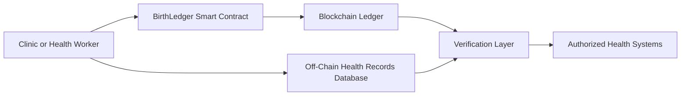

# BirthLedger

BirthLedger is a blockchain-based birth and maternal health event registry designed to improve the integrity, traceability, and accessibility of early-life health records for children.

In many regions, birth records and early maternal health events are fragmented, paper-based, or vulnerable to loss and manipulation. BirthLedger uses blockchain technology to create a tamper-resistant, verifiable record of key health events such as birth registrations, vaccinations, and maternal health visits.

The goal is to provide governments, clinics, and public health systems with a secure digital infrastructure that ensures every child has a trusted record of their earliest health milestones.

This repository contains the MVP smart contract used to record health events on-chain, demonstrating how birth-related data can be securely registered and retrieved using blockchain infrastructure.

## Example Use Case

1. A child is born in a clinic.
2. The clinic records the birth event on BirthLedger.
3. The event is permanently stored on the blockchain.
4. The child's health records can later be verified by authorized systems.

## Technology Stack

- Solidity smart contracts
- Hardhat development framework
- Ethereum-compatible blockchain

## Vision

BirthLedger is designed to integrate with maternal health platforms like NEKAH to create a secure digital infrastructure for maternal and infant health data.

## Impact for Children

BirthLedger strengthens the integrity of early-life health records by ensuring that critical events such as birth registrations, antenatal care visits, and vaccinations are securely recorded and verifiable.

For millions of children in low-resource settings, fragmented or lost health records can lead to missed vaccinations, lack of continuity in care, and difficulty proving identity later in life. BirthLedger introduces a tamper-resistant registry that allows healthcare providers and health systems to maintain reliable maternal and child health histories.

By enabling trusted digital health records from the moment of birth, BirthLedger supports stronger healthcare delivery, better monitoring of child health outcomes, and improved access to services for children and families.

## System Architecture

The BirthLedger system records key maternal and child health events using blockchain verification while keeping sensitive data stored securely off-chain.

